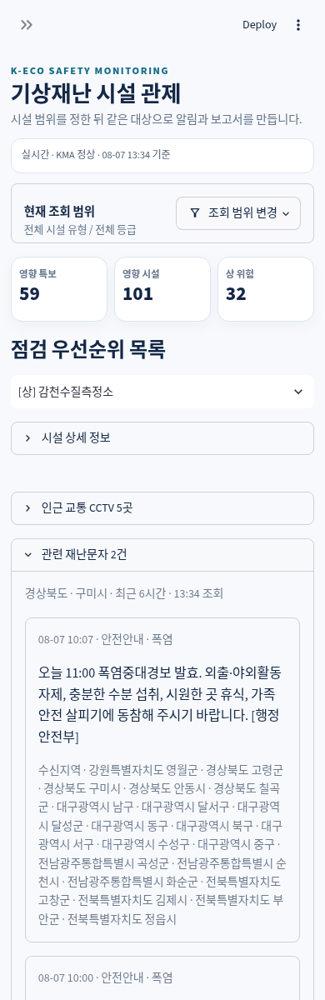

# 기상재난 시설 관제 간편 사용 안내

내부 시험 사용자를 위한 간단한 안내입니다. 전달받은 Streamlit 링크를 스마트폰이나 PC에서 열어 사용합니다.

## 1. 현재 상황 확인

- 상단에서 `실시간 · KMA 정상`과 기준 시각을 확인합니다.
- `영향 특보`, `영향 시설`, `상 위험` 숫자로 현재 상황을 빠르게 파악합니다.
- 필요한 경우 `조회 범위 변경`에서 시설 유형이나 위험도 등급을 선택합니다.

## 2. 점검할 시설 확인

- `점검 우선순위 목록`에서 시설을 선택합니다.
- `시설 상세 정보`를 펼치면 판정 근거, 권장 행동, 담당, 주소를 볼 수 있습니다.
- CCTV는 시설 자체 영상이 아니라 선택 시설 주변의 고속도로·국도 영상입니다.
- 재난문자와 Google 뉴스는 참고정보이며 위험도 판정에는 반영되지 않습니다.

## 3. 지도 사용

- 스마트폰에서는 한 손가락으로 페이지를 스크롤합니다.
- 지도를 이동하거나 확대하려면 지도 안의 `지도 조작 켜기`를 누릅니다.
- 시설 마커와 특보 구역을 함께 확인합니다.

## 4. 후속 작업

- `후속 작업 대상`을 펼치고 필요한 시설만 체크합니다.
- 같은 체크 결과로 Telegram 알림이나 PDF 보고서를 만들 수 있습니다.
- **Telegram은 실제 메시지가 발송되므로 안내받은 경우에만 실행합니다.**

## 사용 중 문제가 생기면

화면 캡처와 함께 `발생 시각`, `선택한 시설`, `사용 기기(스마트폰/PC)`를 전달해 주세요.

